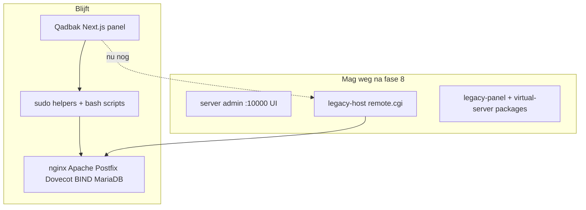

# legacy hosting API/server admin verwijderen — wat Qadbak nog nodig heeft

Je VPS na **phase 8 independent** (`provisioner: native`, `legacyApiFallback: false`):

| Laag | Status |
|------|--------|
| **Panel UI** | Qadbak — geen server admin-tab |
| **Domeinlijst + hosting** | `native-domains.json` + `provisioning-helper` (geen `remote.cgi`) |
| **Lifecycle** | Clone, transfer (panel), migrate (backup + handmatige stappen) — native |
| **Admin** | License, templates, admins, global features, S3, check-config — native |
| **Nginx panel** | Geen `/embed/legacy-panel/` in standaard templates |
| **Linux-stack** | nginx, Postfix, Dovecot, BIND, MariaDB — **blijft** |

**`apt remove legacy-panel`** is geen functionele blocker meer als `bash scripts/audit-vm-dependency.sh` groen is en je panel-tests slagen. Zie [PHASE-8-INDEPENDENT.md](./PHASE-8-INDEPENDENT.md) voor handmatige apt-stappen.

---

## Drie lagen (niet door elkaar halen)



---

## Checklist: native vervanging per gebied

Prioriteit voor **één testdomein** (bijv. `example.com`) — daarna pas `apt remove`.

| Gebied | Nu op VPS | Native nodig | Richting in repo |
|--------|-----------|--------------|------------------|
| Domeinlijst | hybrid JSON | ✅ klaar | `native-domains.json` |
| Website / vhost | Qadbak nginx scripts | ✅ grotendeels | `apply-customer-nginx-vhosts.sh`, `fix-domain-website.sh` |
| Bestanden | `domain-fs-helper` | ✅ klaar | — |
| Terminal | `qadbak-terminal` WS | ✅ klaar | — |
| SSL Let's Encrypt | native `ssl` flag | 🟡 | `certbot` — test op VPS |
| DNS records | native `dns` flag | 🟡 | `.hosts` zone files — test panel |
| Mail mailboxen | native `mail` direct | 🟡 | Postfix `virtual` + Maildir — test create/list |
| Databases | native `db` flag | 🟡 | `mysql` root — test panel |
| Cron | native `cron` flag | 🟡 | `crontab -u` |
| Backups | native `backup` flag | 🟡 | `~/backups/*.tar.gz` |
| Nieuw/verwijder domein | native `domain` | ✅ | `domain-create` / `domain-delete` (+ sub/alias) |
| Proxies | native `proxies` | ✅ | nginx `proxies.json` |
| Scripts (WP, …) | native `scripts` | ✅ | ZIP installers onder `public_html` |
| Spam/DKIM | native `security` | 🟡 | OpenDKIM + SpamAssassin (host packages) |
| Resellers/plannen | native `resellers` | 🟡 | JSON registry (metadata) |
| PHP versie / pool | native `php` | 🟡 | host PHP layout |
| FTP accounts | native `ftp` | 🟡 | proftpd-oriented |
| Admin server status | Qadbak + systemctl | ✅ | `host-services-helper` |
| Lifecycle clone/transfer/migrate | native lifecycle + admin | ✅ | `domain-clone`, `domain-transfer`, `domain-migrate` |
| Admin license/templates/admins/cloud | native admin | ✅ | `provision-admin.mjs` |

🔴 = blokkeert package removal voor dagelijks gebruik  
🟡 = deels / handmatige stappen (migrate tussen servers)  
🟢 = klaar in independent mode

Zie [PARITY-AUDIT.md](./PARITY-AUDIT.md) voor het volledige menu.

---

## Wat je al hebt (geen tweede “eigen panel” bouwen)

- **Panel** = Qadbak (auth, RBAC, UI) — dat *is* je eigen panel.
- **Provisioner** = plug-in: `legacy-host` → `hybrid` → `native`.
- **Stack** = bestaande OS-diensten, bestuurd door scripts (fase 5–6).

Je bouwt geen server admin-kloon; je vervangt **remote.cgi-aanroepen** door **gevalideerde scripts** (zoals Hestia `v-add-domain`).

---

## Stappen op je test-VPS (veilig)

### Nu (gedaan / bezig)

```bash
curl -s http://127.0.0.1:3000/api/health
# provisioner: hybrid

# Panel: Domains, Files, Terminal — zonder server admin-tab
# Mail/DNS/SSL: werken nog via VM API op de achtergrond
```

### Volgende ontwikkeling (repo) — **geïmplementeerd als sub-fases**

Zie [NATIVE-PHASES.md](./NATIVE-PHASES.md).

| Sub-fase | Commando op VPS |
|----------|-----------------|
| 8a SSL | `sudo bash scripts/apply-phase8-native-phase.sh ssl` |
| 8b DNS | `... phase.sh ssl,dns` |
| 8c domain | `... domain` |
| 8d mail | `... mail` (CLI, geen API) |
| 8e db | `... db` |
| 8f backup | `... backup` |
| 8g cron | `... cron` |
| Alles | `sudo bash scripts/apply-phase8-native-enable.sh` |

```bash
bash scripts/audit-vm-dependency.sh
sudo bash scripts/test-native-provisioning.sh
```

Wanneer alles getest:

```bash
sudo bash scripts/apply-phase8-independent.sh
bash scripts/audit-vm-dependency.sh
```

### Pas daarna: pakketten eraf (irreversibel zonder backup)

```bash
sudo systemctl stop legacy-panel account-panel 2>/dev/null || true
sudo apt-get remove -y --purge legacy-panel account-panel 'legacy-host-*'
sudo apt-get autoremove -y
sudo bash scripts/export-native-domains.sh   # registry backup
```

Backup eerst: `/home`, `/etc/nginx`, `/etc/postfix`, `/etc/bind`, databases.

---

## Inschatting

| Scope | Tijd (indicatie, 1 dev) |
|-------|-------------------------|
| Geen server admin UI (fase 1–8 hybrid) | ✅ op test-VPS |
| Mail + DNS + SSL native voor 1 domein | 2–4 maanden |
| Volledige v1-pariteit zonder VM | grotendeels ✅ in repo |
| `apt remove legacy-panel` veilig op productie | na `audit-vm-dependency` + panel smoke tests |

---

## E2E / preflight

Phase 8 preflight gebruikt `test-native-domains.sh`, niet `list-domains`. Na `git pull`:

```bash
sudo -u qadbak bash scripts/v1-test-preflight.sh
```

Zie [PHASE-8-NATIVE.md](./PHASE-8-NATIVE.md) · [QADBAK-INDEPENDENCE-8-PHASES.md](./QADBAK-INDEPENDENCE-8-PHASES.md).
